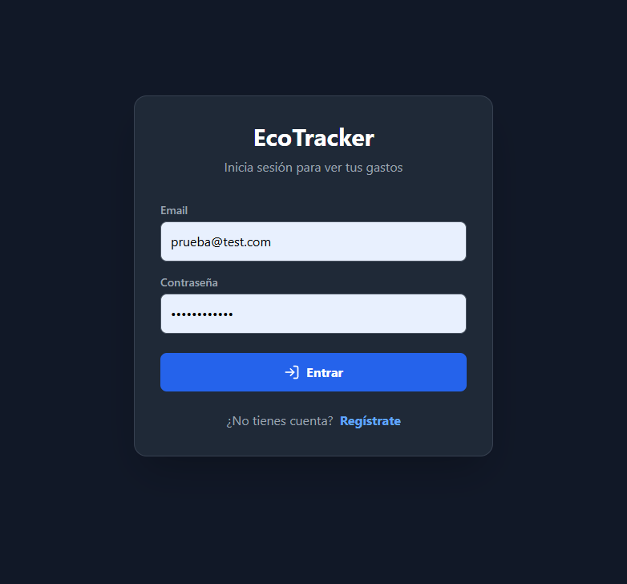
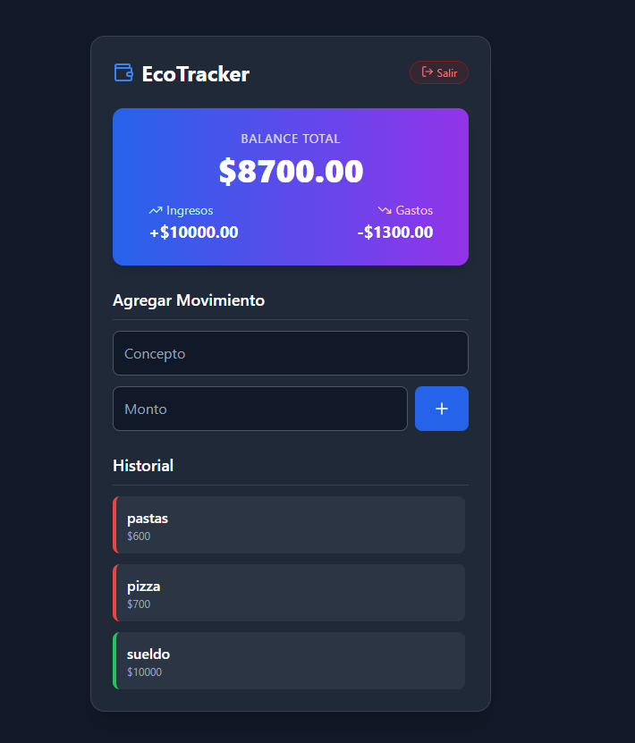
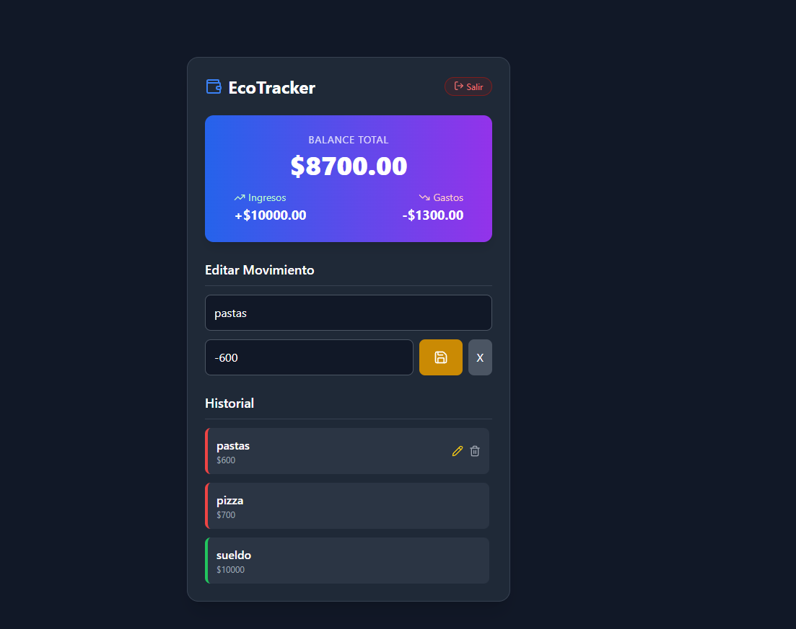

#  EcoTracker - Control de Gastos con IA

Aplicación web Full Stack para la gestión de finanzas personales. Permite registrar ingresos y gastos, visualizar el balance en tiempo real y mantener un historial seguro en la nube.

**Trabajo Práctico Final - Inteligencia Artificial**

##  Tecnologías Utilizadas
* **Frontend:** React + TypeScript + Vite
* **Estilos:** Tailwind CSS (Diseño Responsivo & Dark Mode)
* **Backend & Base de Datos:** Supabase (PostgreSQL)
* **Autenticación:** Supabase Auth
* **Testing:** Vitest + React Testing Library
* **Deploy:** Vercel

##  Funcionalidades (Requisitos Cumplidos)
- [x] **Autenticación:** Sistema de Login y Registro seguro.
- [x] **CRUD Completo:**
    - **C**reación de transacciones.
    - **L**ectura de historial.
    - **A**ctualización (Edición) de montos y conceptos.
    - **E**liminación de registros.
- [x] **Seguridad:** Políticas RLS (Row Level Security) para que cada usuario vea solo sus datos.
- [x] **UI/UX:** Interfaz moderna, modo oscuro y adaptable a celulares.

##  Screenshots

| Login | Dashboard | Edición |
|:---:|:---:|:---:|
|  |  |  |

##  Instrucciones de Instalación

1.  **Clonar el repositorio:**
    ```bash
    git clone [https://github.com/TiagoIrusta/tp-final-ia-expense-tracker.git](https://github.com/TiagoIrusta/tp-final-ia-expense-tracker.git)
    ```

2.  **Instalar dependencias:**
    ```bash
    npm install
    ```

3.  **Configurar Variables de Entorno:**
    Crea un archivo `.env` en la raíz del proyecto basándote en el archivo `.env.example`:
    ```env
    VITE_SUPABASE_URL=tu_url_de_supabase
    VITE_SUPABASE_ANON_KEY=tu_clave_anonima
    ```

4.  **Correr el proyecto:**
    ```bash
    npm run dev
    ```

5.  **Ejecutar Tests:**
    ```bash
    npm run test
    ```

## Desarrollo con IA
Este proyecto fue desarrollado utilizando un flujo de trabajo asistido por IA:
1.  Generación de prototipo UI.
2.  Refactorización de componentes.
3.  Generación de lógica de base de datos (SQL).
4.  Creación de Tests Unitarios automatizados.